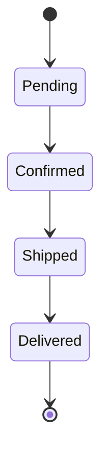

---
name: "Mermaid Diagrams in Markdown"
description: "Always-on authoring rules for Mermaid diagrams in Markdown files: fencing, diagram type selection, GitHub rendering constraints, accessibility, and versioning."

## applyTo: "**/*.md"

# Mermaid Diagrams in Markdown

## Mandatory fencing

All Mermaid diagrams MUST use the ` ```mermaid ` fenced code block syntax. Never use ` ```mmd `, ` ```diagram `, or any other tag.

✅ Correct:

````markdown

````

❌ Wrong:

````markdown
```mmd

graph LR
    A --> B

```
````

## Deprecated syntax — never use

| Deprecated | Replacement |
|---|---|
| `graph LR` / `graph TD` | `flowchart LR` / `flowchart TD` |
| `stateDiagram` | `stateDiagram-v2` |
| `pie title` (old format) | `pie\ntitle ...` |

## GitHub rendering constraints

- Keep node count ≤ 50 per diagram; split larger diagrams.

- Do not use beta diagram types (`xychart-beta` etc.) in primary documentation that must render reliably.

- Special characters in labels (`<`, `>`, `&`, `"`) must be escaped as HTML entities or wrapped in double quotes.

- `click` links work in rendered README/wiki views but not in PR diff previews.

## Accessibility requirement

Every Mermaid diagram with > 5 nodes MUST be accompanied by a prose description — either immediately before or immediately after the code block — that summarises what the diagram conveys.

````markdown
The following diagram illustrates the order lifecycle from placement to delivery.



_Summary: Orders progress from Pending → Confirmed → Shipped → Delivered._
````

## Diagram versioning

- Store standalone diagrams as `.mmd` files committed alongside the docs they describe.

- Never commit only a rendered PNG without the Mermaid source.

- For inline diagrams (within a `.md` file), that `.md` file is the source of truth.

- Generated PNG/SVG exports are derived artifacts — do not include them in PR review diffs.

## Diagram type guidance

- **Process / pipeline flows**: `flowchart LR` or `flowchart TD`

- **API / actor interactions**: `sequenceDiagram`

- **Domain models**: `classDiagram` or `erDiagram`

- **Lifecycle / FSM**: `stateDiagram-v2`

- **Git history**: `gitGraph`

- **Schedules**: `gantt`

- **Architecture context**: `C4Context`

## Complexity limits

- Max 5 levels of nesting for flowcharts.

- Max 8 participants for sequence diagrams.

- Max 10 classes per class diagram — split by bounded context.

## CI validation

For repositories with Markdown docs that contain Mermaid diagrams, add a CI step:

```yaml
- name: Validate Mermaid diagrams
  run: |
    npm install -g @mermaid-js/mermaid-cli
    find . -name '*.mmd' -exec mmdc -i {} -o /dev/null \;
```

> For deeper Mermaid guidance (all diagram types, theming, CI options), see `.github/skills/mermaid/SKILL.md`.
