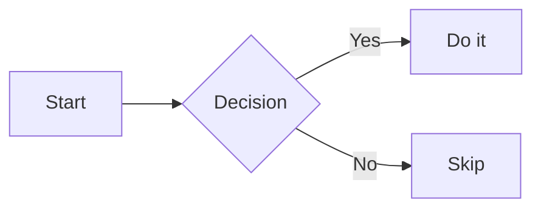
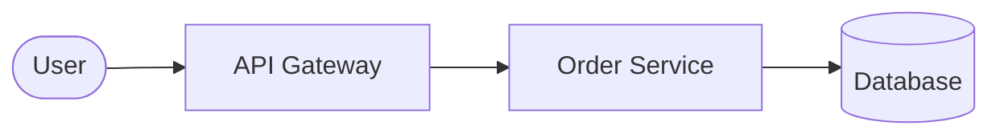
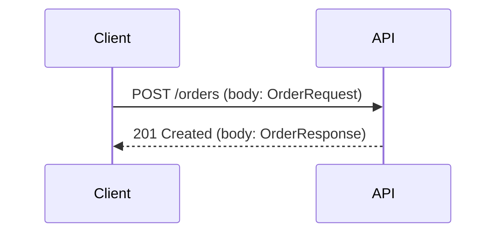
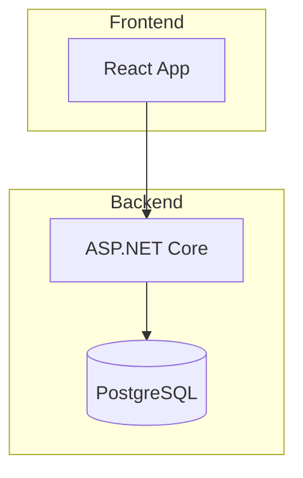
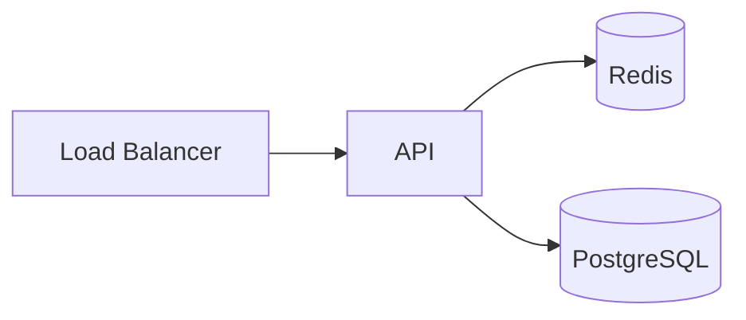
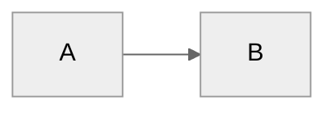
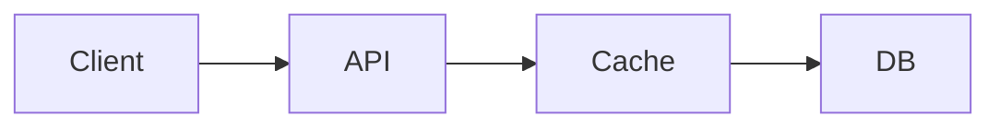

# mermaid Skill (Elite)

## When to use

- You need to create or improve a diagram embedded in a Markdown file (GitHub README, ADR, wiki, PR description, etc.).

- You need to review an existing Mermaid snippet for syntax errors or best-practice violations.

- You are deciding between Mermaid and another diagram format (PlantUML, D2, SVG).

- You need to validate that a diagram renders correctly on GitHub.

> For PlantUML-heavy workflows or complex component diagrams, use the `diagram-tooling` skill instead.

---

## Diagram Type Reference

| Type | Keyword | Best for | GitHub supported |
|---|---|---|---|
| Flowchart | `flowchart LR` / `TD` | Process flows, decision trees | Yes |
| Sequence | `sequenceDiagram` | API calls, actor interactions | Yes |
| Class | `classDiagram` | OOP models, domain entities | Yes |
| Entity-Relationship | `erDiagram` | Database schema | Yes |
| State | `stateDiagram-v2` | State machines, lifecycle | Yes |
| Git Graph | `gitGraph` | Branch/merge history | Yes |
| Gantt | `gantt` | Project timelines | Yes |
| Pie Chart | `pie` | Simple proportions | Yes |
| Mindmap | `mindmap` | Brainstorm trees | Yes |
| Timeline | `timeline` | Chronological events | Yes |
| C4 (Context) | `C4Context` | Architecture context views | Yes (via library) |
| Quadrant | `quadrantChart` | 2x2 scoring matrices | Yes |
| XY Chart | `xychart-beta` | Line/bar data plots | Yes (beta) |
| Requirement | `requirementDiagram` | Requirements traceability | Yes |
| Block | `block-beta` | Generic block diagrams | Yes |

---

## GitHub Rendering (Mandatory Rules)

GitHub natively renders Mermaid inside fenced code blocks with the `mermaid` language tag. No plugin or extension required.

### Correct fencing

````markdown

````

### Constraints on GitHub

- Maximum diagram complexity: keep node count ≤ 50 for readable output; very large graphs exceed GitHub's renderer timeout.

- `%%` comments are supported and encouraged for maintainability.

- `click` interaction links work in rendered GitHub pages but not in PR diff views.

- GitHub's Mermaid version lags behind the latest release; avoid cutting-edge beta features in repo docs.

- Emoji in labels (`A[":rocket: Deploy"]`) render on GitHub but break some local tools — prefer plain text or UTF-8.

### GitLab / other platforms

| Platform | Support | Notes |
|---|---|---|
| GitHub | Native | Fenced block with `mermaid` tag |
| GitLab | Native | Same fencing syntax |
| VS Code | Via extension | Install `Mermaid Preview` or `Markdown Preview Mermaid Support` |
| Confluence | Via plugin | Requires Mermaid macro plugin |
| Notion | Native (limited) | Subset of diagram types |

---

## Authoring Best Practices

### 1. Choose the right direction

- `flowchart LR` (left-right) for sequential pipelines and CI/CD flows.

- `flowchart TD` (top-down) for hierarchies and decision trees.

- `sequenceDiagram` for time-ordered interactions across actors.

### 2. Keep node IDs stable

Use short, stable IDs that match your codebase vocabulary. Avoid auto-generated IDs like `A1`, `B2`.



### 3. Prefer `v2` variants

Use `stateDiagram-v2` over `stateDiagram`. Use `flowchart` over `graph`.

### 4. Add descriptive labels

Labels must describe the action or state clearly, not just the entity.



### 5. Limit depth and width

- Flowcharts: max 4–5 levels of nesting for readability.

- Sequence diagrams: max 6–8 participants; extract sub-flows to separate diagrams.

- Class diagrams: max 10 classes per diagram; split by bounded context.

### 6. Use subgraphs for grouping



### 7. Comments for maintainability



### 8. Theming

Default theme is fine for GitHub. For custom colors, use `%%{init: ...}%%` directives:



Available themes: `default`, `neutral`, `dark`, `forest`, `base`.

---

## Accessibility

- GitHub does not generate alt text for Mermaid diagrams automatically.

- Add a prose description immediately before or after every complex diagram in the Markdown.

- For critical diagrams (architecture, data flow), also provide a text-based summary table.

````markdown
The following diagram shows the request lifecycle from client to database:



_Summary: Client sends request → API checks Redis cache → on miss, queries PostgreSQL._
````

---

## CI Validation

To validate Mermaid syntax in CI without a browser:

### Option A — `@mermaid-js/mermaid-cli` (mmdc)

```bash
npm install -g @mermaid-js/mermaid-cli
mmdc -i diagram.mmd -o /dev/null --quiet
```

### Option B — `mermaid-py` (Python)

```bash
pip install mermaid-py
python -c "import mermaid; mermaid.Mermaid('flowchart LR\n A --> B')"
```

### Option C — Extract and validate in CI (Shell)

```bash
#!/usr/bin/env bash
# Extract all mermaid blocks from markdown files and validate
grep -rn '```mermaid' docs/ | while read -r match; do
  echo "Found mermaid block: $match"
done
# Use mmdc for full validation if available
command -v mmdc && find docs -name '*.md' -exec mmdc -i {} -o /dev/null \;
```

### GitHub Actions step

```yaml
- name: Validate Mermaid diagrams
  run: |
    npm install -g @mermaid-js/mermaid-cli
    find . -name '*.mmd' -exec mmdc -i {} -o /dev/null \;
```

---

## Versioning Discipline

- Store standalone diagrams as `.mmd` files alongside the docs they describe.

- Never commit only a PNG without the Mermaid source.

- When the diagram source is inline in a Markdown file, that Markdown file is the source of truth.

- Generated exports (SVG, PNG) are derived: exclude from review diffs, regenerate in CI.

---

## Common Pitfalls

| Pitfall | Problem | Fix |
|---|---|---|
| `graph LR` | Deprecated; syntax limits | Use `flowchart LR` |
| Very long labels | Breaks layout on GitHub | Abbreviate labels, add legend |
| Too many nodes | Render timeout on GitHub | Split into sub-diagrams |
| Missing `end` in subgraph | Syntax error | Always close `subgraph ... end` |
| Special chars in labels (`<`, `>`) | HTML conflict | Escape with `&lt;` or wrap in quotes |
| `stateDiagram` | Legacy v1 | Use `stateDiagram-v2` |
| Relying on beta features | Not rendered on GitHub | Check GitHub's Mermaid version |

---

## Decision Guide — Mermaid vs. Other Formats

| Criterion | Mermaid | PlantUML | D2 |
|---|---|---|---|
| GitHub native | Yes | No (requires plugin) | No |
| Diagram type variety | High | Very high | High |
| Syntax complexity | Low | Medium | Low |
| CI tooling maturity | Medium | High | Medium |
| Best for | Docs-embedded diagrams | Complex UML | Clean architecture diagrams |

**Rule**: Prefer Mermaid for anything embedded in GitHub Markdown. Use PlantUML only when diagram complexity exceeds Mermaid's capabilities (complex component diagrams, advanced sequence features).

---

## Self-check

- [ ] Diagram type selected is the most appropriate for the content.

- [ ] Fenced block uses ` ```mermaid ` tag (not ` ```mmd `).

- [ ] Node IDs are stable and match repo vocabulary.

- [ ] Diagram depth ≤ 5 levels; node count ≤ 50.

- [ ] `v2` variant used where available (`stateDiagram-v2`, `flowchart` over `graph`).

- [ ] Prose description added before/after complex diagrams (accessibility).

- [ ] Source file committed (`.mmd` for standalone, Markdown file for inline).

- [ ] No deprecated syntax (`graph LR`, `stateDiagram`).

- [ ] GitHub rendering constraints verified (no beta features for critical docs).
