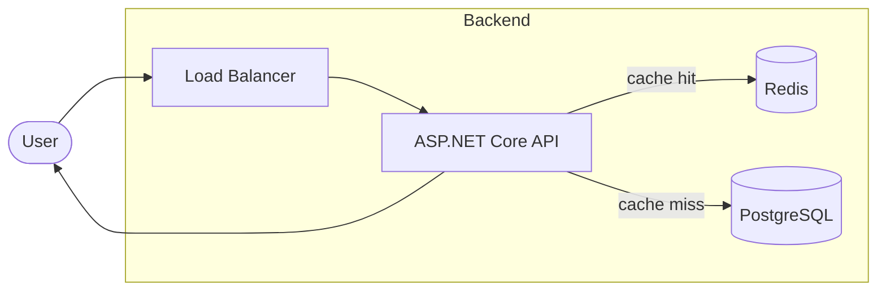
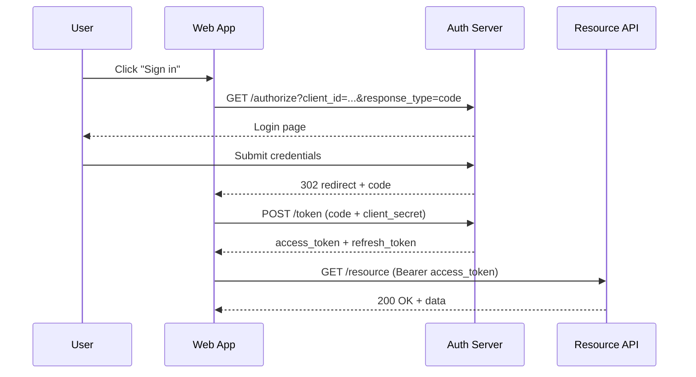
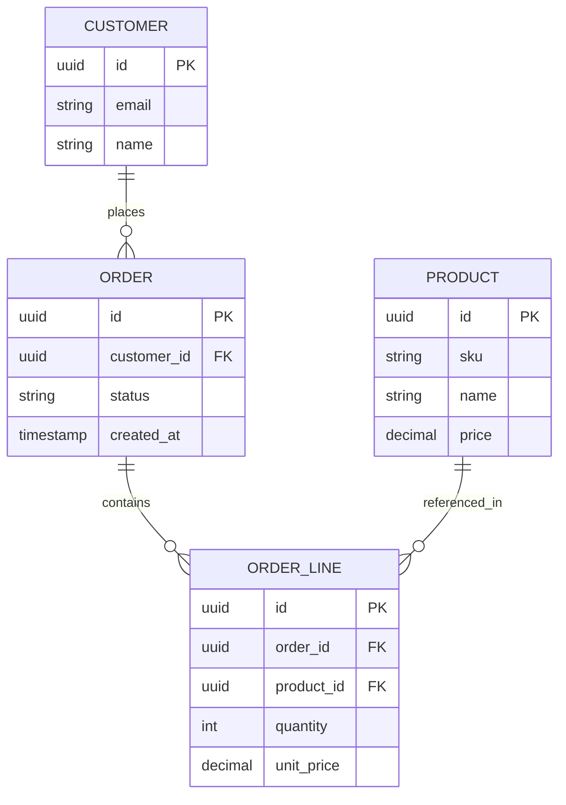
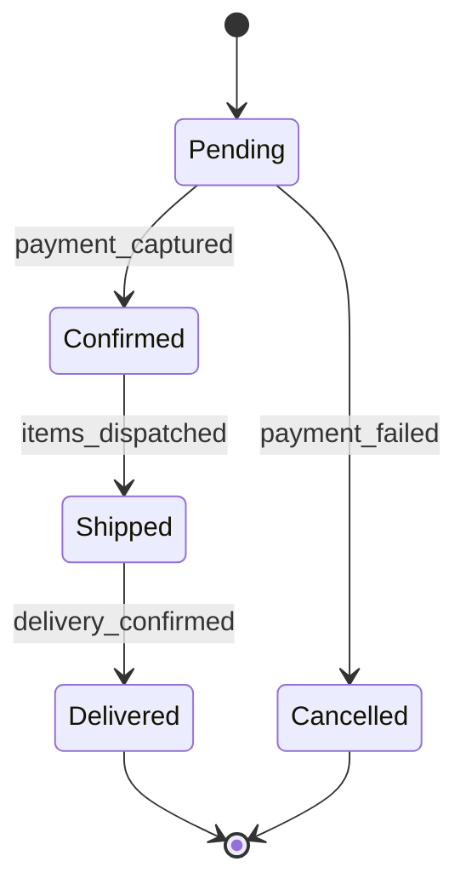
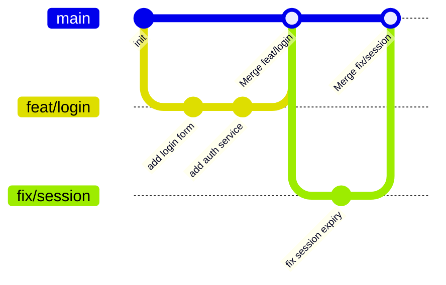
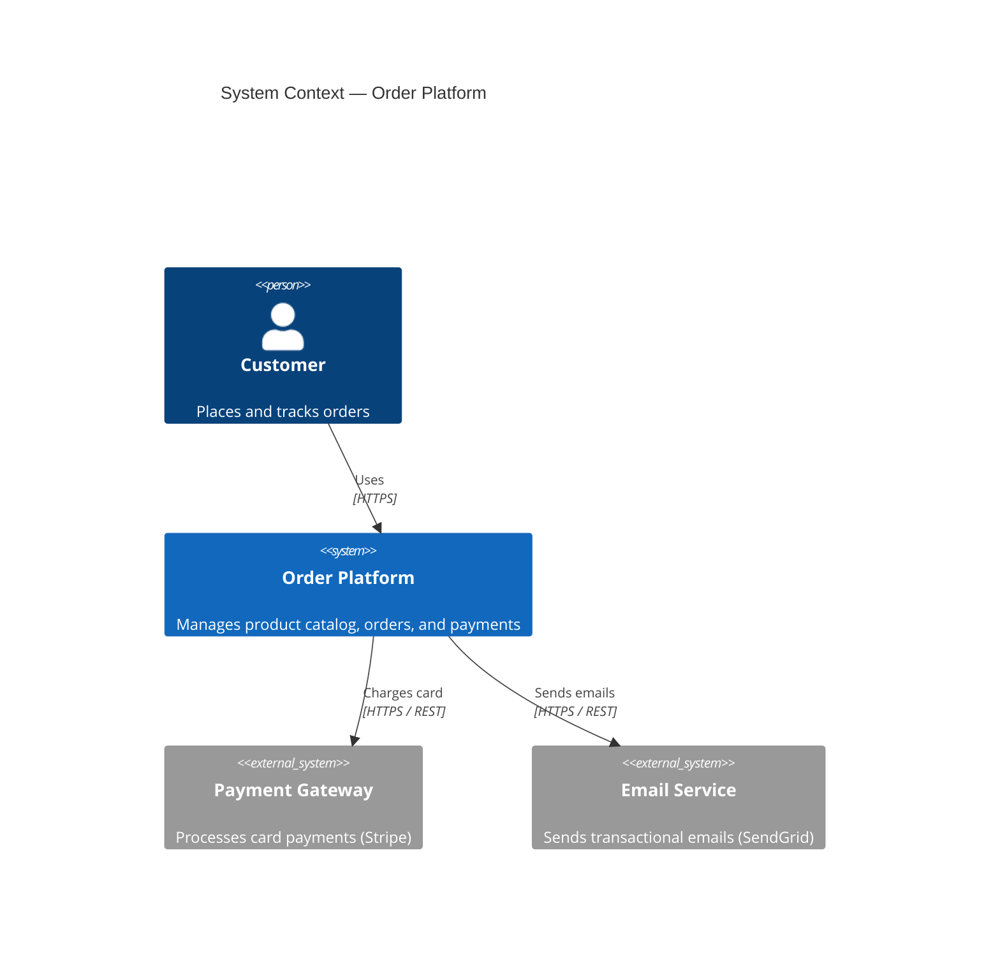

# mermaid skill — Examples

## Example 1: Flowchart (request lifecycle)



## Example 2: Sequence diagram (OAuth 2.0 authorization code flow)



## Example 3: Entity-Relationship diagram



## Example 4: State diagram (order lifecycle)



## Example 5: Git graph



## Example 6: C4 Context diagram



## Embedding guidance

Always add a prose description before or after complex diagrams:

````markdown
The following diagram shows the OAuth 2.0 authorization code flow used by the web application.

```mermaid

sequenceDiagram
    ...

```

_The app exchanges the authorization code for an access token server-side to avoid exposing secrets to the browser._
````
